> Introducing my Home Lab! As a software engineer and general tinkerer, I was incredibly excited to get a home server set up to run services, VMs, and other tools. I often find myself wasting time redownloading VM images only to have them run too slow and take up too much space on my laptop. This is just one inconvenience my homelab solved. Below is a general walkthrough of the server's design, as well as some roadblocks I hit (and how I got around them).

# Hardware

First up - the hardware. I custom-built a micro ATX machine for several reasons. I considered buying something like an Intel NUC, but I wanted the ability to expand down the road, and I wanted something cheaper.

I went with an Intel i5 8400 CPU and sat on Gigabyte's B360M-DS3H motherboard. I started out with a 1 TB SSD and 2x8GB RAM. I got this board to leave enough space for upgrade down the road. The entire build can be found at this [PcPartsPicker Link](https://pcpartpicker.com/user/Josh555444/saved/#view=qd4TCJ).

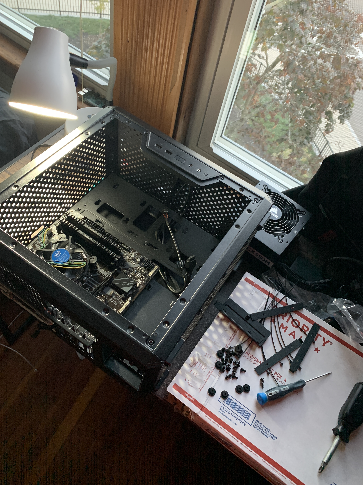

Overall i've been very happy with the hardware. Some minor tweaking aside
(see below), all the hardware i've got works well with my chosen hypervisor.

# ESXI

### Licensing

ESXI is free for personal use! You can request a license at VMWare's website. It took several days for mine to get approved - after that you can add the product key into your ESXI instance.

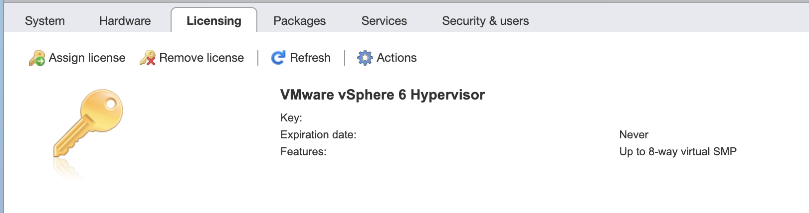

### Fixing Ethernet "No Network Adapters Were Detected"

ESXI isn't _really_ meant to work with consumer hardware. As a result, the integrated network controller on my motherboard was not compatible. My motherboard sports **Realtek 8118** Gaming LAN. The ESXi installer would fail and tell me "A third party driver might be required".

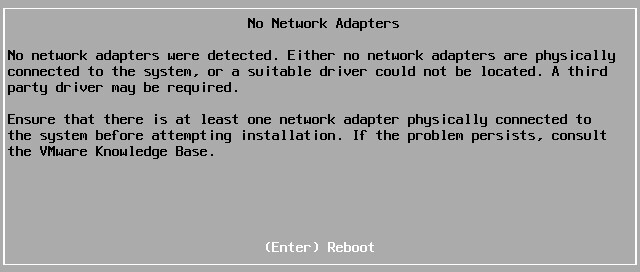

That said, there is a Windows utilty written to patch just this. I followed the steps on this [v-front](https://www.v-front.de/2014/12/how-to-make-your-unsupported-nic-work.html) guide and it's been working great ever since. You'll need Windows to run [Powershell script "ESXI-Customizer"](http://esxi-customizer-ps.v-front.de/).

### Configuration

ESXI lives on a flash drive and is loaded into RAM upon my system's boot. This lets me use my entire SSD for VMs.

### Auto Start

Be sure to enable AutoStart within the ESXI console for important VMs. My lab doesn't have any redundant power, but it's nice that on an unexpected reboot, everything should eventually power back on.

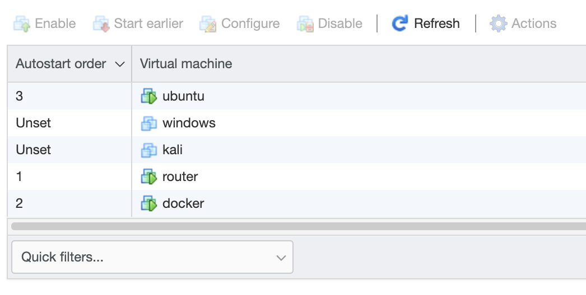

# Topology

My setup is fairly simple and provides ample room for me to spin up/tear down services as i'm working through a project. Here is the basic topology of the system.

```
ESXI Hypervisor:

            | [WAN]
            |
            |
            |
 pfsense |--+--|
            |
            |-- docker +--|-- ...
  windows --|             |-- pihole
   ubuntu --|             |-- portainer
     kali --|             |-- games
      ... --|
      NAS --|
            | [LAN]
```

I go into more detail on many of these services below!

# Networking

## Pfsense

I decided to bridge my home LAN with my lab's LAN through a Pfsense VM. This provides me with a ton of networking features and flexibility.

### Initial Configuration

The first step is to create two Virtual Switches in ESXI, install the Pfsense VM (but don't run yet), and hook up the VM up to different port groups on the switches (I set the names to `LAN` and `WAN`).

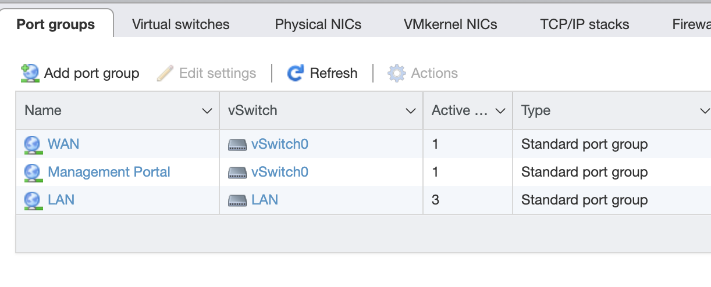

I connected the physical NIC on my machine to the WAN switch so that Pfsense is now sitting in the middle.

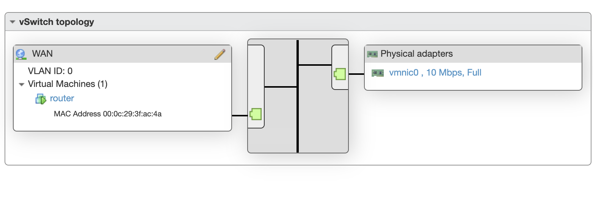

Every additional VM can be attached to the LAN network.

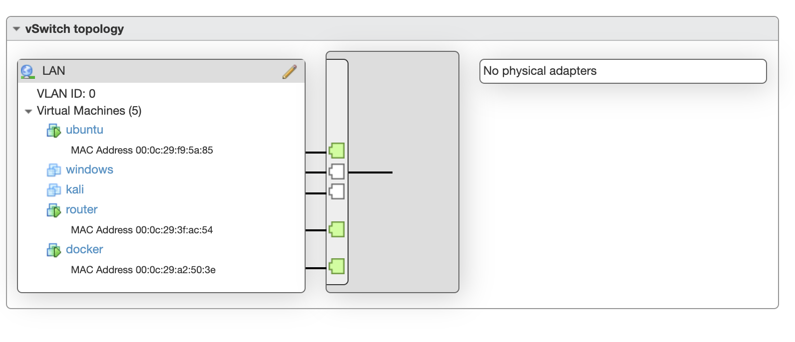

For the most part Pfsense was able to set everything up with little help. It detected which side my WAN was and configured some basic firewall rules, NAT, etc appropriately.

If all goes well you should see both interfaces up in the Pfsense web interface.

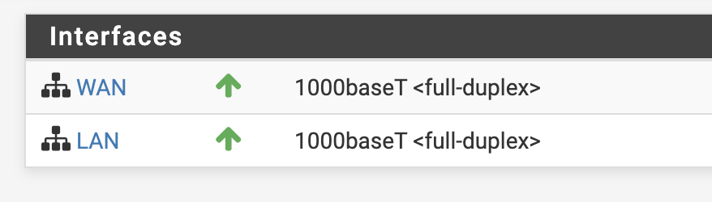

### Additional Configuration

Under `Interfaces > LAN > IPv4 Upstream Gateway` I had flip the value back to `None`. I must have accidently set that during configuration, which caused some debugger as my traffic wasn't being routed.

Under `System > General Setup` I also disabled `DNS Server Override` to prevent using my ISP's DNS server. I set my own preferred DNS servers here that would be sent out to my LAN over DHCP.

### VPN with Pfsense (routing DNS routes)

I took advantage of Pfsense's VPN wrapper to get an external route to inside my lab. I'm also forwarding all my DNS traffic (nice for using pihole!).

Most of the VPN setup is point and click. If you decide to use Server Mode `Remote Access (User Auth)` (without SSL/TLS), you **won't** need to create individual entries in the `VPN > Clients` tab.

If you use `Local Database` for authentication, it will probably be a good idea to create a new non-admin user in `System > User Manager`. You do not need to provide any permissions to the new user.

For easy config export I installed a Pfsense package titled `openvpn-client-export`. This lets pfsense generate the client configs for you.

To avoid DNS leakage, be sure to provide a DNS server list to the clients.

Connected via VPN from my laptop, you can now see that my DNS requests are being forwarded.

```bash
~ ❯❯ nslookup joshspicer.com
Server:		10.15.0.1
Address:	10.15.0.1#53

Non-authoritative answer:
Name:	joshspicer.com
Address: 185.199.109.153
Name:	joshspicer.com
Address: 185.199.111.153
```

This coupled with PiHole (see below) allows for private and optimized DNS.

**Sidenote** If you use TunnelBlick on Mac, you'll want to make sure you have "Allow changes to manually-set network settings", or else you may not get your DNS server set.

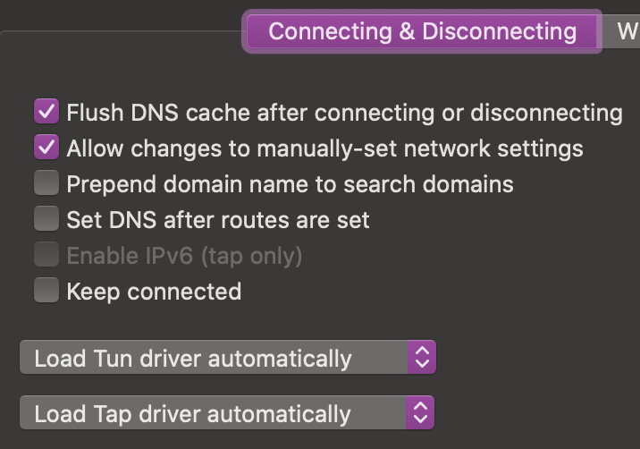

### Dynamic DNS with PfSsense (Cloudflare)

Another convience that pfsense offers is dynamic dns polling. I set up the service to point my domain to my WAN's IP.

# Services

## Docker Host

I'm running my docker host on Ubuntu 18.10. Despite checking "install docker" at OS installation, at time of writing Ubuntu eoan (Find with `lsb_release -cs`) is not supported. I followed [docker's guide](https://docs.docker.com/install/linux/docker-ce/ubuntu/#install-using-the-repository) to manually install docker, changing lsb_release to ubuntu 18.04's codename "disco".

```bash
sudo add-apt-repository \
   "deb [arch=amd64] https://download.docker.com/linux/ubuntu \
   disco \
   stable"
```

I set up a static IP/DNS with ubuntu's new Netplan interface in `/etc/netplan/50-cloud-init.yaml`. I set up a static IP at OS configuration, but I had to come in here to set my nameserver.

```yaml
network:
  ethernets:
    ens160:
      addresses:
        - 10.15.2.1/16
      gateway4: 10.15.0.1
      nameservers:
        addresses: [10.15.0.1]
  version: 2
```

Apply with:

```bash
netplan apply
```

Add yourself to the docker group with:

```bash
sudo usermod -aG docker $USER
```

### Pihole setup

One gotcha is that you need to first disable ubuntu's built-in DNS resolver

```bash
sudo systemctl disable systemd-resolved.service
sudo systemctl stop systemd-resolved.service
```

Here is my `docker-compose`.

```yaml
version: "4"
services:
  pihole:
    container_name: pihole
    image: pihole/pihole:latest
    ports:
      - "53:53/tcp"
      - "53:53/udp"
      - "67:67/udp"
      - "443:443/tcp"
      - "80:80/tcp"
    environment:
      TZ: ${TZ}
      WEBPASSWORD: "my-initial-web-password" #changeme
    # Volumes for persistent storage.
    volumes:
      - /home/josh/docker/pihole/etc-pihole:/etc/pihole/
      - /home/josh/docker/pihole/etc-dnsmasq.d/:/etc/dnsmasq.d/
    dns:
      - 127.0.0.1
      - 1.1.1.1
    restart: unless-stopped
```

Be sure to change that password:

```bash
# Get a shell on the pihole container
docker exec -it pihole /bin/bash
# Change password from admin interface
pihole -a -p
```

Note that now you will need pihole running for local DNS resolution on your docker host.

Bring up pihole by typing:

```bash
docker-compose up -d pihole
```

The Docker host has IP `10.15.2.1` and all DNS requests on port `53` are being proxied to this docker container. By setting PfSense to use this host as our primary DNS server, all our DHCP hosts now get the benefits of Pihole.

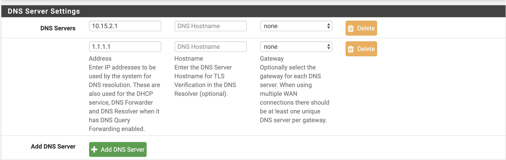

You can see from the Pihole logs that ads are being blocked, and the request originated from our router at IP `10.15.0.1`.

This request originated from my laptop through a VPN tunnel at a coffee shop.

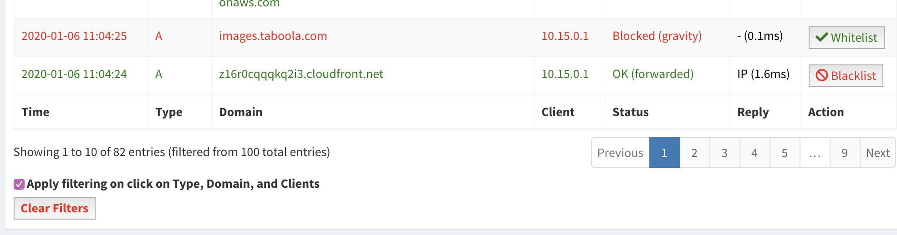

You can check the pihole stats and status through their web interface as well.

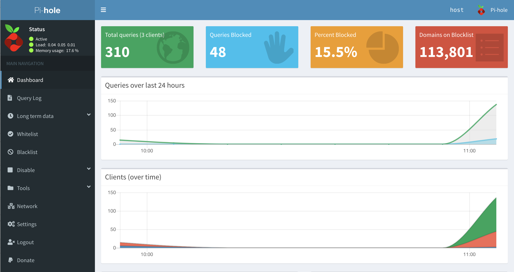

### Portainer Setup

Portainer is a web-based GUI for managing docker containers.

The setup is as easy as running:

```bash
docker volume create portainer_data

docker run -d -p 9000:9000 -p 8000:8000 --name portainer \
   --restart always -v /var/run/docker.sock:/var/run/docker.sock \
   -v portainer_data:/data portainer/portainer
```

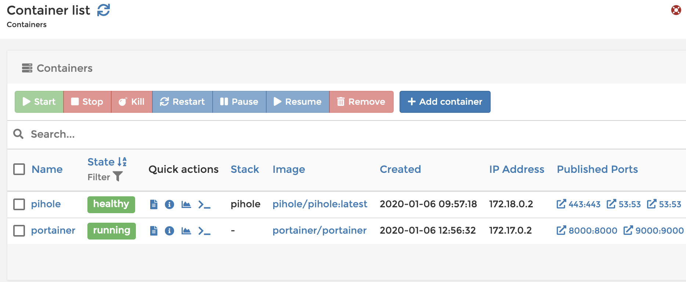

## Workstations

I have several ISOs loaded for various workstation OSs (Windows, Debian). These have already come in handy for running OS-specific software, testing, and more.

I'm working on a hackintosh VM - (if it's done) details can be found here [esxi-hackintosh](esxi-hackintosh).
